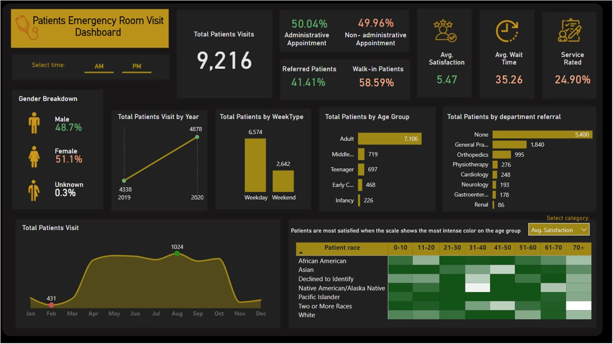
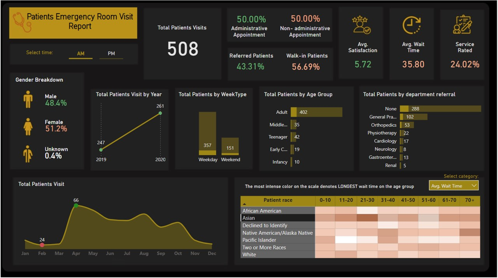
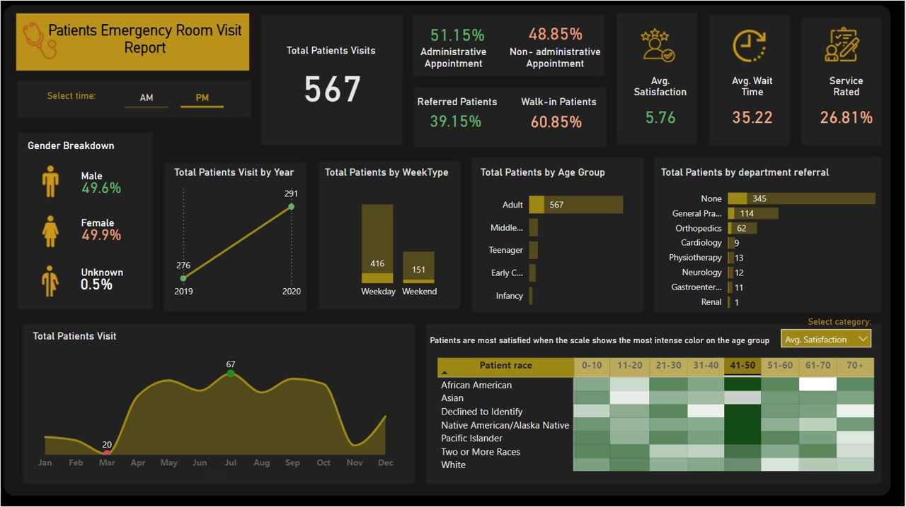

# Patients Emergency Room Visit Report using Power BI

***
 

  
  <h4> Description </h4>
  
 Hospitals are important in Australia’s health care system providing medical care to millions of Australia every year. There are private and public hospitals in Australia. 

  <ul>
  <li align= "justify"> Private hospitals - owned and managed by private organizations (some non-profit) and funded by charges to patients often subsidized by government and private health insurance </li>
  <li align= "justify"> Public hospitals - largely owned and managed by state and territory governments with funding from the Australian government. </li>
  </ul>
  
 Any person with ‘medicard’ can access public hospital services free of charge as a public patient on the basis of clinical need and within a clinically approved period.  Such services can be admitted services, non-admitted services, or emergency department (ED) services.  

  
 This dashboard shows relevant information on recognized and approved public hospitals in Australia, such as the number of beds and available services. The ‘mapping’ option shows the location and details of the public hospitals with filterable options. The drop-down menu can be used to filter for state or territory.   

***
 

#### Functionality

**A. Dashboard**

 

***Data source***

* The data was sourced from Australian Institute of Health and Welfare (AIHW) webpage, "Hospital resources 2021-2022 data tables", released December 2023 at [https://www.aihw.gov.au/reports-data/myhospitals/content/data-downloads](https://www.aihw.gov.au/reports-data/myhospitals/content/data-downloads)

 

*Image by DC Studio on [Freepik](https://www.freepik.com/).*

***
 

#### Preview

 

 

 
