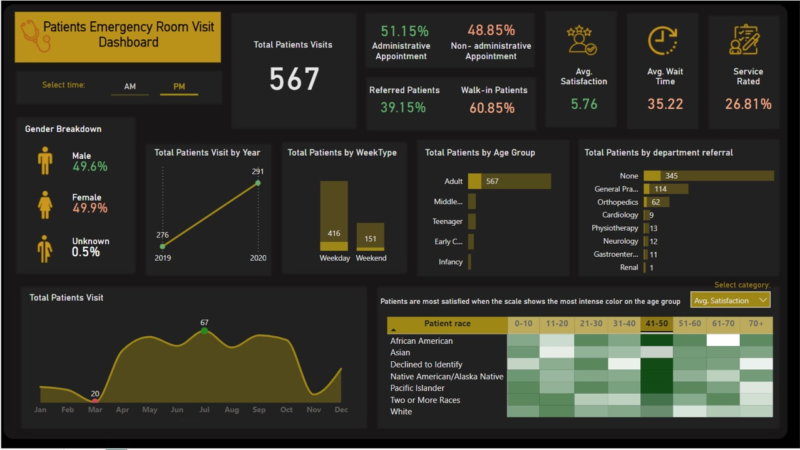

# Patients Emergency Room Visit Report using Power BI

***
 

  
  <h4> Description </h4>
  
 This patient visits to emergency room dashboard exemplifies a healthcare analytic tool that is an essential resource for: 

  <ul>
  <li align= "justify"> tracking and understanding patient flow for resource planning and utilization to prevent overcrowding, identify potential bottlenecks, and aid workforce (staffing) management </li>
  <li align= "justify"> improving patient care and facilitate quick triage </li>
  <li align= "justify"> identifying areas for experience improvement from patient satisfaction feedback </li>
  </ul>

***
 

#### Functionality

The dashboard provides insights into the number of patients visiting the emergency room based on:

*a. Timeframe*

- Total number of patients up-to-date
-	Total patients by year or month
-	Total patients visiting during mornings or afternoons
-	Total patients visiting during weekdays or weekends

*b. Demographics*

-	Breakdown of patients by gender
-	Total patients by age group
-	Total patients by race

*c. Category*

-	Total patients by department referral
-	Percentage of referred and walk-in patients
-	Percentage of patients by administrative and non-administrative appointments

The dashboard also includes:

- *Average Waiting Time*: Based on the selected filters.
-	*Average Satisfaction Rate*: Based on responses to the satisfaction survey, with the percentage of completed surveys shown as ‘service rated’.

Both the average waiting time and satisfaction rate can be filtered by age group and patient race.

 

***Data source***

* The data used in this dashboard is sourced from a learning video by "Data with Decision" and can be sourced here: [https://drive.google.com/file/d/1h7SHRhKeP9jP1axeYRtKg-TE3UldhiYx/view](https://drive.google.com/file/d/1h7SHRhKeP9jP1axeYRtKg-TE3UldhiYx/view)
  
 

*Image by DC Studio on [Freepik](https://www.freepik.com/).*

***
 

#### Preview

Selected time: *AM and PM* | Selected category: *Avg. Satisfaction*

 

Selected time: *AM* | Selected category: *Avg. Wait Time*  | Selected Patient race: *Asian*

 

Selected time: *PM* | Selected category: *Avg. Satisfaction*  | Selected Patient age group : *41-50*

 
